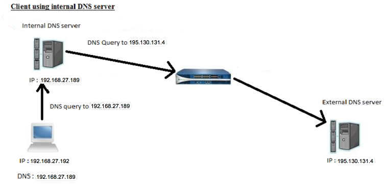

# YouTube DNS SinkHole 

## How it works
Block all adds using a DNS sinkhole rather than an add blocker.

 Some websites may refute you access if you have an ad-blocker disabled. This uses a DNS sinkhole that maliciously redirects the ad-clients requests to non-existent servers letting you browse the internet without ads, trackers e.t.c

Our pihole DNS sinkhole in the above diagram would be the internal DNS server

This repo adds a few known YouTube add sources to list1.txt and list2.txt

Copy all contents of list1.txt and list2.txt into ./etc/pihole/black.list. This will be automapped to the docker container using volumes

## Running 

Pi-hole has been install on my computer using Docker. You can use a computer such as the Raspberry PI or literally any other computer to run a network DNS sinkhole on your local network at home 

https://github.com/pi-hole/docker-pi-hole/#running-pi-hole-docker

Please point your local DNS settings to 
127.0.0.1 where the pi-hole DNS sink-hole sits. For more information, see attached documentation

https://pi-hole.net/
